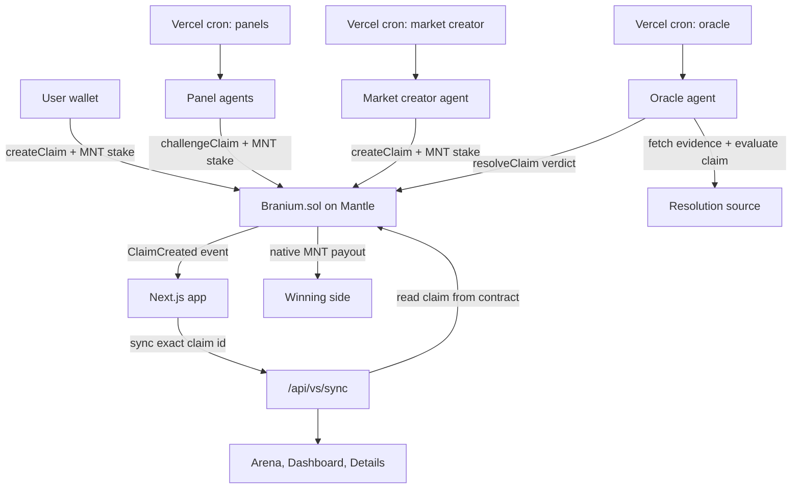
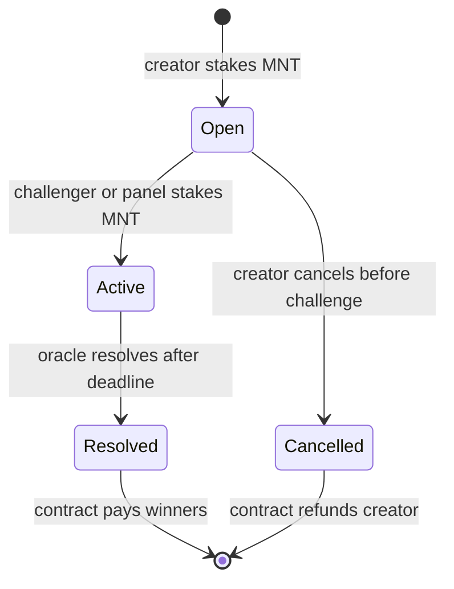
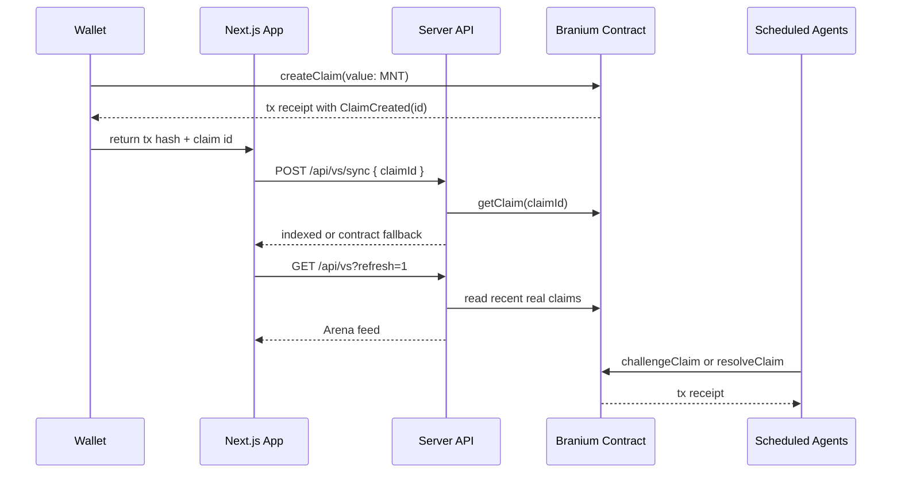

# Branium.

Branium is an on-chain claim market on Mantle. A user creates a claim, stakes MNT on one side, and other wallets or panel agents can challenge the other side. When the deadline passes, the oracle agent checks the agreed evidence source, writes the verdict to the contract, and the contract pays the winning side.

The app does not use IndexedDB or browser storage as a source of truth for markets. Market state comes from the Branium smart contract. When a wallet creates a claim, the UI reads the emitted `ClaimCreated` event to get the real claim ID, then asks the server to index that exact on-chain claim.

Live app: [brainium-rho.vercel.app](https://brainium-rho.vercel.app)

## How It Works



## Market Lifecycle



## Main Pieces

- `contracts/Branium.sol` holds claim state, MNT stakes, challengers, verdicts, and payouts.
- `app/vs/create/page.tsx` creates markets from the connected wallet.
- `lib/contract.ts` wraps contract reads and writes with viem/wagmi.
- `lib/server/vs-index.ts` serves the market feed from the contract, with an optional database index when `DATABASE_URL` exists.
- `agents/market-creator` creates source-backed markets on a schedule.
- `agents/panels` runs the panel signers that stake on claims.
- `agents/oracle` settles expired claims by checking the claim evidence source and calling `resolveClaim`.
- `app/api/cron/*` exposes Vercel-protected cron endpoints.

## Runtime Flow



## Data Truth

The contract is the source of truth.

- No market state is trusted from IndexedDB.
- No pending market cache is trusted from `localStorage`.
- The feed uses real contract reads when no database index is configured.
- `DATABASE_URL` is optional and only speeds up indexed reads. It does not replace the contract.
- `CRON_SECRET` protects scheduled endpoints from public execution.

## Agents And Cron

Vercel runs these daily schedules from `vercel.json`:

| Route | Schedule | Job |
| --- | --- | --- |
| `/api/cron/oracle` | `5 0 * * *` | Settles expired claims when conditions are ready. |
| `/api/cron/market-creator` | `15 0 * * *` | Creates a capped number of source-backed markets. |
| `/api/cron/panels` | `25 0 * * *` | Lets configured panel signers evaluate and stake. |
| `/api/cron/sync` | `35 0 * * *` | Warms the optional server index when a database exists. |

The cron routes require:

```txt
Authorization: Bearer <CRON_SECRET>
```

## Environment

Create `.env.local` from `.env.example`.

Required for the app:

```txt
NEXT_PUBLIC_CONTRACT_ADDRESS=0x...
NEXT_PUBLIC_MANTLE_RPC=https://rpc.sepolia.mantle.xyz
MANTLE_RPC=https://rpc.sepolia.mantle.xyz
```

Required for scheduled agents:

```txt
ORACLE_PRIVATE_KEY=0x...
MARKET_CREATOR_PRIVATE_KEY=0x...
PANEL_MOMENTUM_PRIVATE_KEY=0x...
PANEL_RISK_PRIVATE_KEY=0x...
PANEL_CONTRARIAN_PRIVATE_KEY=0x...
PANEL_SIGNAL_PRIVATE_KEY=0x...
PANEL_LIQUIDITY_PRIVATE_KEY=0x...
PANEL_TOKEN_PRIVATE_KEY=0x...
PANEL_MATCH_PRIVATE_KEY=0x...
PANEL_WEATHER_PRIVATE_KEY=0x...
PANEL_STRESS_PRIVATE_KEY=0x...
PANEL_PULSE_PRIVATE_KEY=0x...
OPENROUTER_API_KEY=sk-or-...
OPENROUTER_MODEL=google/gemini-2.5-flash
CRON_SECRET=...
```

Optional:

```txt
DATABASE_URL=postgresql://...
NEXT_PUBLIC_WC_PROJECT_ID=...
```

## Local Development

```bash
npm install
npm run dev
```

Open [http://localhost:3000](http://localhost:3000).

Useful checks:

```bash
npx tsc --noEmit
npm run test:smoke
npm run build
```

Run agents locally only when the signer keys are funded and you want real Mantle transactions:

```bash
npm run oracle
npm run market-creator
npm run panels
```

## Contract Deployment

Compile:

```bash
npm run compile:contract
```

Deploy:

```bash
DEPLOYER_PRIVATE_KEY=0x... ORACLE_ADDRESS=0x... npm run deploy:contract
```

After deploying, set:

```txt
NEXT_PUBLIC_CONTRACT_ADDRESS=<deployed contract>
NEXT_PUBLIC_DEPLOY_BLOCK=<deployment block>
```

## Production Deploy

The app is deployed on Vercel.

```bash
npx vercel deploy --prod
```

After deployment, verify:

```bash
curl https://brainium-rho.vercel.app/api/vs?refresh=1
curl https://brainium-rho.vercel.app/api/vs/1
```

Those responses should return real contract-backed claims, not placeholder data.
